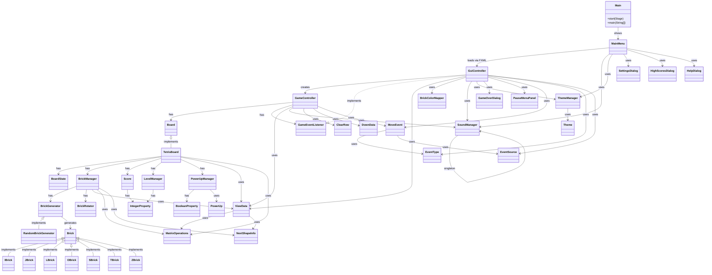

# Tetris Class Diagram

```mermaid
classDiagram
    class Main {
        +start(Stage)
        +main(String[])
    }
    Main --> MainMenu : shows
    MainMenu --> GuiController : loads via FXML
    GuiController --> GameController : creates
    GameController --> Board : has
    Board <|-- TetrisBoard : implements
    TetrisBoard --> BoardState : has
    TetrisBoard --> BrickManager : has
    TetrisBoard --> Score : has
    TetrisBoard --> LevelManager : has
    TetrisBoard --> PowerUpManager : has
    BrickManager --> BrickGenerator : has
    BrickManager --> BrickRotator : has
    BrickGenerator <|-- RandomBrickGenerator : implements
    BrickGenerator --> Brick : generates
    Brick <|-- IBrick : implements
    Brick <|-- JBrick : implements
    Brick <|-- LBrick : implements
    Brick <|-- OBrick : implements
    Brick <|-- SBrick : implements
    Brick <|-- TBrick : implements
    Brick <|-- ZBrick : implements
    GuiController ..|> GameEventListener : implements
    GameController --> GameEventListener : has
    Score --> IntegerProperty : has
    LevelManager --> IntegerProperty : has
    PowerUpManager --> BooleanProperty : has
    PowerUpManager --> PowerUp : uses
    GuiController --> ViewData : uses
    GameController --> ViewData : uses
    TetrisBoard --> ViewData : uses
    BrickManager --> ViewData : uses
    ViewData --> MatrixOperations : uses
    BrickManager --> MatrixOperations : uses
    TetrisBoard --> MatrixOperations : uses
    GuiController --> BrickColorMapper : uses
    GuiController --> SoundManager : uses
    GameController --> SoundManager : uses
    MainMenu --> SoundManager : uses
    SoundManager --> SoundManager : singleton
    GuiController --> ThemeManager : uses
    ThemeManager --> Theme : uses
    MainMenu --> ThemeManager : uses
    GuiController --> GameOverDialog : uses
    GuiController --> PauseMenuPanel : uses
    MainMenu --> SettingsDialog : uses
    MainMenu --> HighScoresDialog : uses
    MainMenu --> HelpDialog : uses
    GameController --> ClearRow : uses
    GameController --> DownData : uses
    GameController --> MoveEvent : uses
    MoveEvent --> EventType : uses
    MoveEvent --> EventSource : uses
    GuiController --> MoveEvent : uses
    GuiController --> EventType : uses
    GuiController --> EventSource : uses
    BrickManager --> NextShapeInfo : uses
    ViewData --> NextShapeInfo : uses
```

